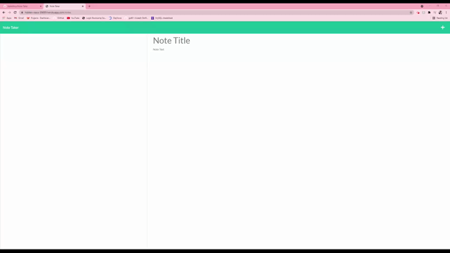

# Note Taker Express

## Description

An application called Note Taker that can be used to write and save notes using an Express.js back-end and deployed live on Heroku.

### Live Deployment

https://hidden-oasis-30659.herokuapp.com/

## Demo Gif:

## Table of Contents

- [Installation](#installation)
- [Usage](#usage)
- [License](#license)

## Installation

_Steps required to install this project and get the application running (localhost):_

npm i express, npm start

## Usage

_Instructions for use:_
When running npm start it should open up your Note Taker on local host, and the user will be able to ENTER, SAVE, and DELETE notes.

## License

Open

### Questions?

For any questions, please contact me with the information below:

GitHub: [@babelitoo](https://api.github.com/users/babelitoo)
